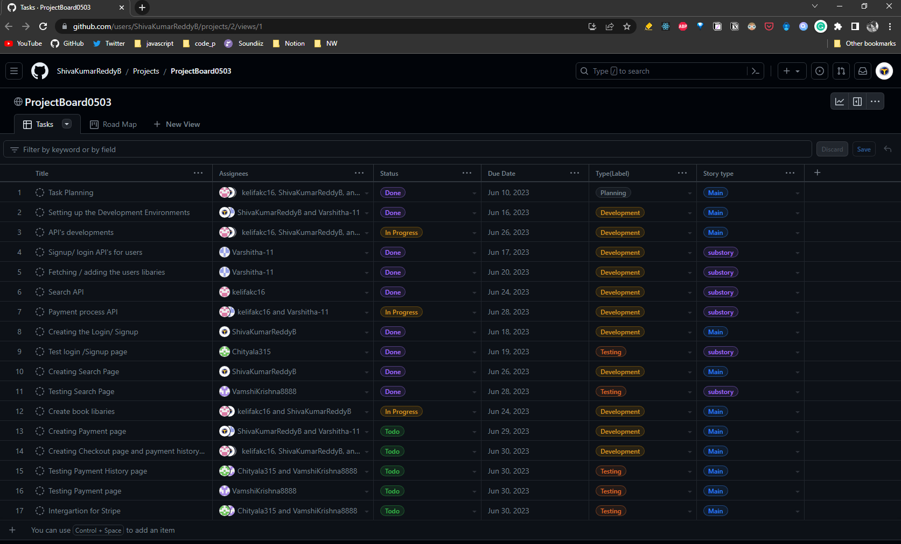

# 44618-DrCase-Group3

### 1.Project Links
1. [Varshitha Gunnala(S564534)](https://github.com/Varshitha-11)
2. Naresh Chitvala(S562113)
3. [Shiva Kumar Reddy Bakkannagari(S564550)](https://github.com/ShivaKumarReddyB)
4. [Vamshi Krishna Yadav Gunnala (S564843)](https://github.com/VamshiKrishna8888)
5. [Kelifa Kc (S560305)](https://github.com/Kelifakc16)

[Project Board link](https://github.com/users/ShivaKumarReddyB/projects/2)

 
### 2.Working with Project Boards

For our group project, GitHub Projects and Kanban boards have proven to be very helpful. They provide a clear visual picture of our workflow, enabling us to delegate jobs to team members and quickly understand the tasks at hand. For cooperation and coordination, it was really helpful to be able to generate and manage cards for each narrative or assignment, assign them to specific people, and monitor their progress on the Kanban board. It made sure that everyone was responsible for their allocated duties, helped us keep organized, and helped us prioritize assignments. 

### 3.Possible Applications
GitHub Projects and Kanban can greatly assist our future group projects, including the MS-ACS Directed Graduate Project. They simplify task management, foster collaboration, and enable progress tracking. By visualizing our work and prioritizing tasks, we can efficiently allocate resources. The transparency and accountability they provide facilitate effective coordination within the team. Moreover, the reporting capabilities help us stay organized and make informed decisions. In summary, GitHub Projects and Kanban will be valuable tools for our future group projects.